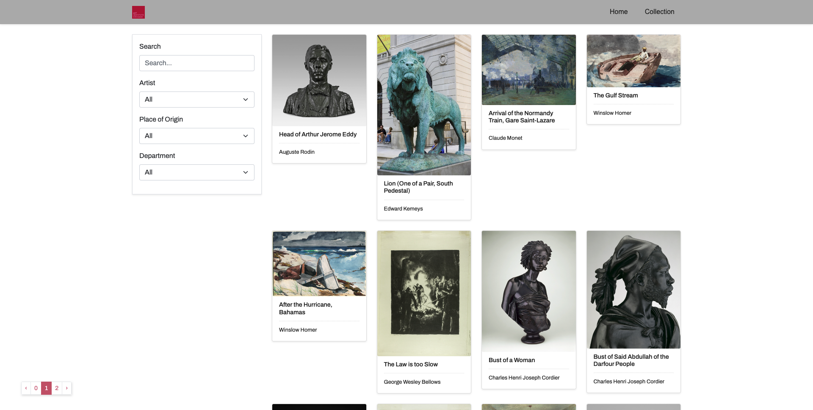

# SEI-project-two

## The Brief

Pair project/programming, hackathon style, 2 days

Create a React app deployed online that consumes a public API and that has multiple components.

## Project Members

- Me ([Eliott McKenzie](https://github.com/eli099))
- [Matthew Shek](https://github.com/MatthewCCS)

## The Idea

We decided to use the [Art Institute of Chicago's public API](https://api.artic.edu/docs/) to create an app that allows users to view their continuously updated collection of art. Users can carry out general searches or filter by _artist_, _place of origin_ or _department_ and also view details about each piece of art.



## Deployment

https://aic-eliott.netlify.app/

## Technologies used

- React
- HTML
- CSS
- Sass
- React Bootstrap
- Bootstrap
- Git/GitHub
- Axios
- Visual Studio Live Share
- Insomnia

## Approach

Prior to starting the project Matthew and I researched public APIs to see if we could find anything we thought would be great to use.

Once the project started we discussed our idea and together we decided to use the [Art Institute of Chicago's API](https://api.artic.edu/docs/). We looked through the documentation to figure out the request endpoints and how they worked. Then tested these endpoints using Insomnia. We also took this time to get familiar with the structure of the database and its key/value pairs so that we could decide which data to display in our app.

Together we mapped out our app with a wireframe using Exacalidraw. We wanted to display all the art pieces from their database as an index and be able to search and filter through them using the data keys we found in the database. We then wanted users to be able to click on a piece of art and be taken to a page showing more details about it.


We coded together for the majority of the project, using Live Share to easily see in real time what eachother was working on, and to be able to quickly address any issues or bugs that popped up. Towards the end of the project we worked on some things separately to make the best use of time as the deadline approached.

We started by setting up the base of the project using a React template and defining routes using `react-router-dom`.

---

### Index page

We set up an axios get request to the main endpoint (found in AIC's documentation) and saved the data returned in our `artList` state. In the JSX we mapped through this and destructured the data to return the values that we wanted to display. This was so that a `Card` for each artwork would be displayed.

Most of the structure and styling was done with Bootstrap/React Bootstrap.

Below is the initial code - which we updated, as you will see further down.

```jsx
// Main art list
const [artList, setArtList] = useState([]);

// Get request
useEffect(() => {
  const getArtList = async () => {
    try {
      const { data } = await axios.get("https://api.artic.edu/api/v1/artworks");
      setArtList(data.data);
    } catch (error) {
      console.log(error);
    }
  };
  getArtList();
}, []);
```

**The JSX:**

We destructured the data and used the values of each key for a piece of art in the JSX, and styled this with Bootstrap.

```jsx
<Col md="9">
  <Row>
    {setArtList.map((art) => {
      const { id, title, artist_title, image_id } = art;
      return (
        <Col key={id} md="6" lg="3" className="art mb-4 container-fluid">
          <Link to={`/artworks/${id}`}>
            <Card className="shadow-sm">
              <Card.Img
                src={`https://www.artic.edu/iiif/2/${image_id}/full/843,/0/default.jpg`}
              />
              <Card.Body>
                <Card.Title>{title}</Card.Title>
                <hr />
                <Card.Text>{artist_title}</Card.Text>
              </Card.Body>
            </Card>
          </Link>
        </Col>
      );
    })}
  </Row>
</Col>
```

### Search & Filters

Next, we focused on implementing a way to search and filter through the data. We defined one object state, `filters` to track the search term **and** the JSON keys to filter. This was to simplify our code and avoid having double the amount of unnecessary states that would be harder to keep track of.

To create the search function, we used a function to track input by the user in our search bar form and then `RegExp` and control flow to test these terms against values within the database.

For the filters we first populated our dropdowns by checking the data returned from the request with an `includes()` method. Then we created `onChange` events on our dropdown menus for each key that we wanted, and used this to update corresponding states that we could then use to map through the data.

We had some trouble when the input and the dropdown menus didn't filter the results but after asking for help we realised we hadn't specified our return requirements properly and with the right logical operators - `&&` and `||`.

Below is our process of allowing the user to search and filter through the data. We created states corresponding to each filter, and a `filters` object to track the current user input.

```js
// Dropdown filter artists
const [artists, setArtists] = useState([]);

// Dropdown filter origin
const [origins, setOrigins] = useState([]);

// Dropdown filter departments
const [departments, setDepartments] = useState([]);

// The resulting filtered art
const [filteredArt, setFilteredArt] = useState([]);

// One object to track/store search terms and filters
const [filters, setFilters] = useState({
  searchTerm: "",
  artist: "all",
  placeoforigin: "all",
  department: "all",
});
```

**Function to spread in values to the `filters` state:**

```js
// handle change for search and filter
const handleChange = (e) => {
  setFilters({ ...filters, [e.target.name]: e.target.value });
};
```

```js
// useEffect to filter art & add to
useEffect(() => {
  if (artList.length) {
    const regexSearch = new RegExp(filters.searchTerm, "i"); // Use the regular expression constructor function on the filters -> searchTerm key
    const filtered = artList.filter((art) => {
      // test the search term against these keys in the JSON
      return (
        (regexSearch.test(art.artist_title) ||
          regexSearch.test(art.title) ||
          regexSearch.test(art.term_titles) ||
          regexSearch.test(art.place_of_origin) ||
          regexSearch.test(art.department_title)) &&
        (art.artist_title === filters.artist || filters.artist === "all") &&
        (art.place_of_origin === filters.placeoforigin ||
          filters.placeoforigin === "all") &&
        (art.department_title === filters.department ||
          filters.department === "all")
      ); // control flow so that filters do not clash and respond appropriately
    });
    setFilteredArt(filtered); // set these to the filteredArt state to be able to use in the JSX
  }
}, [filters, artList]);
```

**We then changed our JSX to map through `filteredArt` instead of `artList`:**

```jsx
{
  /* The Art Index */
}
<Col md="9">
  <Row>
    {filteredArt.map((art) => {
      const { id, title, artist_title, image_id } = art;
      return (
        <Col key={id} md="6" lg="3" className="art mb-4 container-fluid">
          <Link to={`/artworks/${id}`}>
            <Card className="shadow-sm">
              <Card.Img
                src={`https://www.artic.edu/iiif/2/${image_id}/full/843,/0/default.jpg`}
              />
              <Card.Body>
                <Card.Title>{title}</Card.Title>
                <hr />
                <Card.Text>{artist_title}</Card.Text>
              </Card.Body>
            </Card>
          </Link>
        </Col>
      );
    })}
  </Row>
</Col>;
```

### Detail view

This was a lot easier to implement. In AIC's document we found an endpoint that points to one artwork just by appending its unique ID number. So on the index page we created a `Link` component for each `Card` with the artwork's ID at the end - see above. Then for the details page we used that URL with `useParams()` as a parameter to send as part of the get request to return that specific document.

```js
useEffect(() => {
    const getSingleArt = async () => {
      try {
        const { data } = await axios.get(`https://api.artic.edu/api/v1/artworks/${id}`)
        setSingleArt(data.data)
        console.log(data)
      } catch (error) {
        setErrors(true)
      }
    }
    getSingleArt()
  }, [id])
```

Then we used the object keys within our JSX to display the information that we wanted:
- image url
- artist name
- artist's short biography
- the medium
- when it was completed
- country of origin
- category

---

### Pagination

We wanted to be able to limit the amount of art displayed on each page, and be able to navigate through these. Thankfully the documentation includes an endpoint template that allows pagination. Despite this we had some initial trouble figuring out how to utilise this.

We eventually figured out that we could use Bootstrap pagination with event listeners and connect these to a state that tracks the current page number. Based on this `pageNumber` state we were able to include it within the request endpoint as a template literal, and also use it as a dependency:

```js
useEffect(() => {
  const getArtList = async () => {
    try {
      const { data } = await axios.get(
        `https://api.artic.edu/api/v1/artworks?page=${pageNumber}&limit=100`
      );
      setArtList(data.data);
    } catch (error) {
      console.log(error);
    }
  };
  getArtList();
}, [pageNumber]);
```

**The pagination component:**

```jsx
<Pagination size="sm" className="justify-content-center">
  <Pagination.Prev onClick={handleClickPrev} />
  <Pagination.Item> {pageNumber <= 0 ? "0" : pageNumber - 1}</Pagination.Item>
  <Pagination.Item active>{pageNumber}</Pagination.Item>
  <Pagination.Item>{pageNumber + 1}</Pagination.Item>
  <Pagination.Next onClick={handleClickNext} />
</Pagination>
```

As a result, each time a user clicks to go forwards or backwards the state is changed and a new get request is started.

---

For the remainder of the project we focused on styling using a mixture of Sass and Bootstrap/React Bootstrap. We decided to keep it simple - which I also think allows the art to take the main focus.

## Challenges

- Getting to grips with Bootstrap -> There are some things you can do with CSS that you can’t do with Bootstrap, so we used a mixture of CSS/Sass and Bootstrap/React Bootstrap - we had to figure out how to manipulate different elements using both

- Figuring out how to filter through the API in React

## Bugs

- The scroll position doesn't reset after navigating to different routes so it may seem like the page is blank but, all the contents are at the top

- We can only search and filter through the current page of results, not the whole database

- Some images return as null. The database is regularly updated so, we figured out that some items added to the database are added initially without an image

## Wins

- Using live share to work on the same document at the same time

- We found an endpoint that allowed us to paginate through AIC’s database, so we used params to let the user click buttons to move the previous or next page of results

## Key learnings

- Having a better understanding of props and routing
- How to work together as a team
- How to search and filter through APIs

## Future Features

- Add a loading icon to the index page so that the user knows the data is still loading (as the get request takes a few seconds and the user might think that the app isn't working otherwise). This is especially apparent when using pagination to navigate from page to page
- Find a way to remove the unnecessary top and bottom margins around the index page images - make them fit together like tiles
- Alter the pagination depending on the amount of data present i.e. if there's no more data to display then disable the next page/number icons
- Add a ternary operator to display an error if no data is returned
- Set the scroll position to the top when clicking through to different routes
- Figure out a way to search and filter through the whole database
